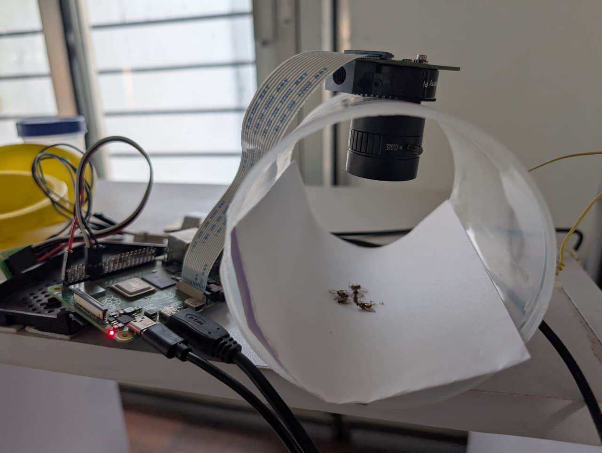
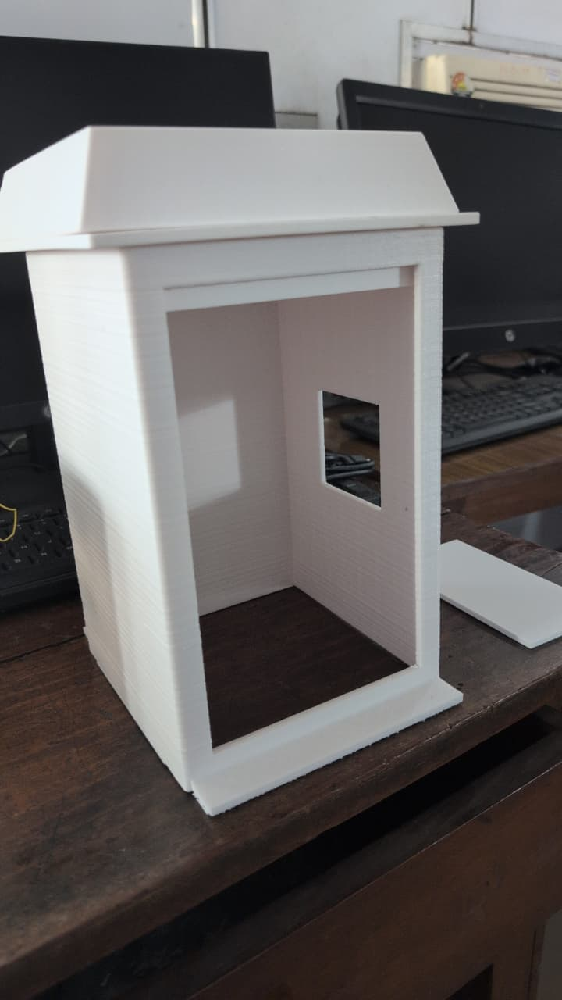
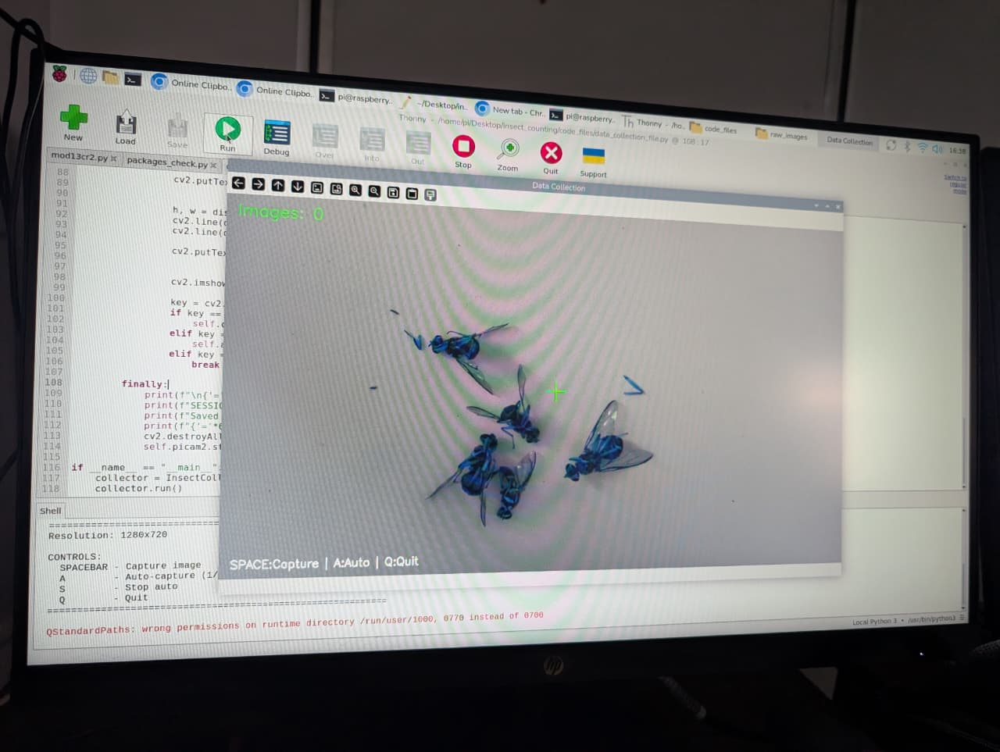
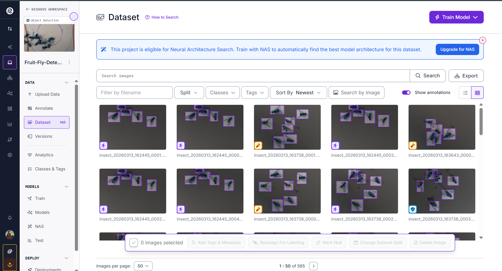
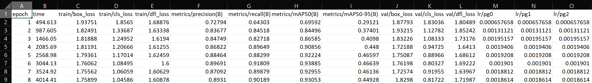
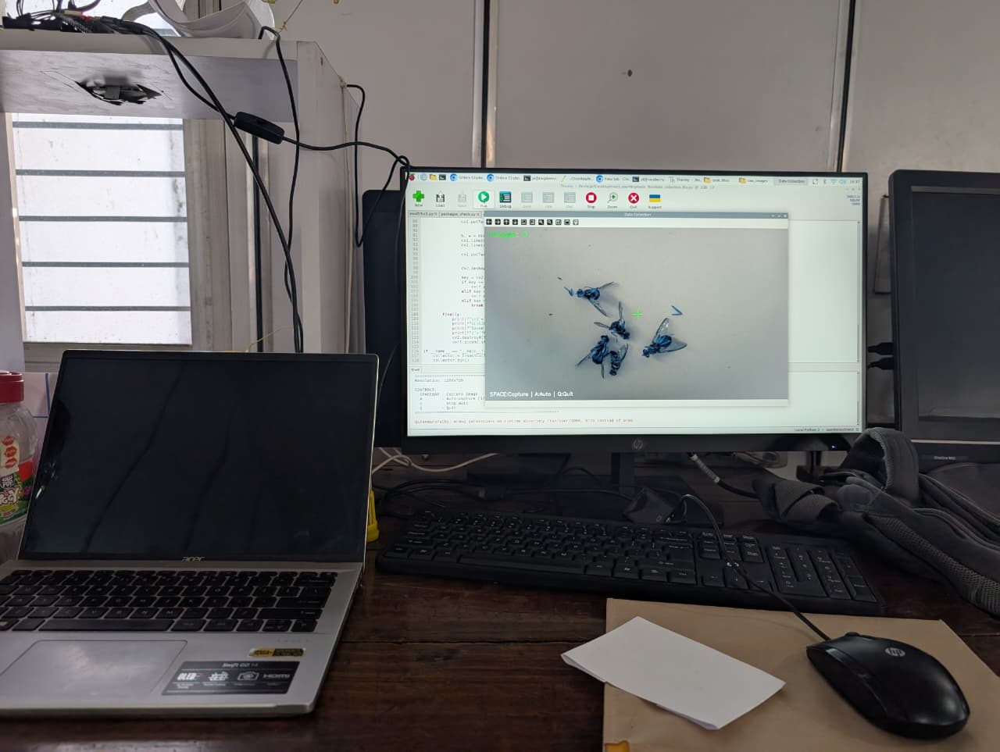
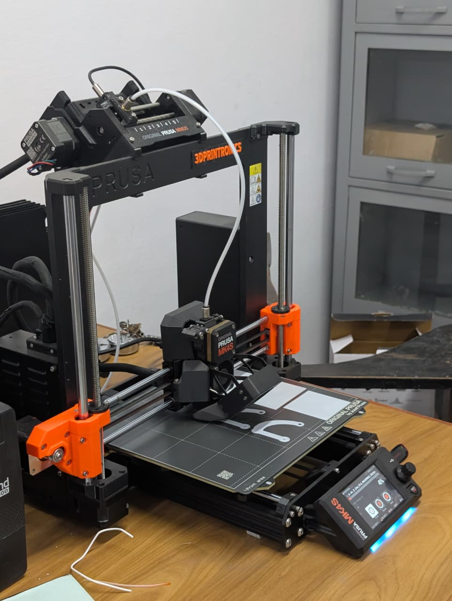
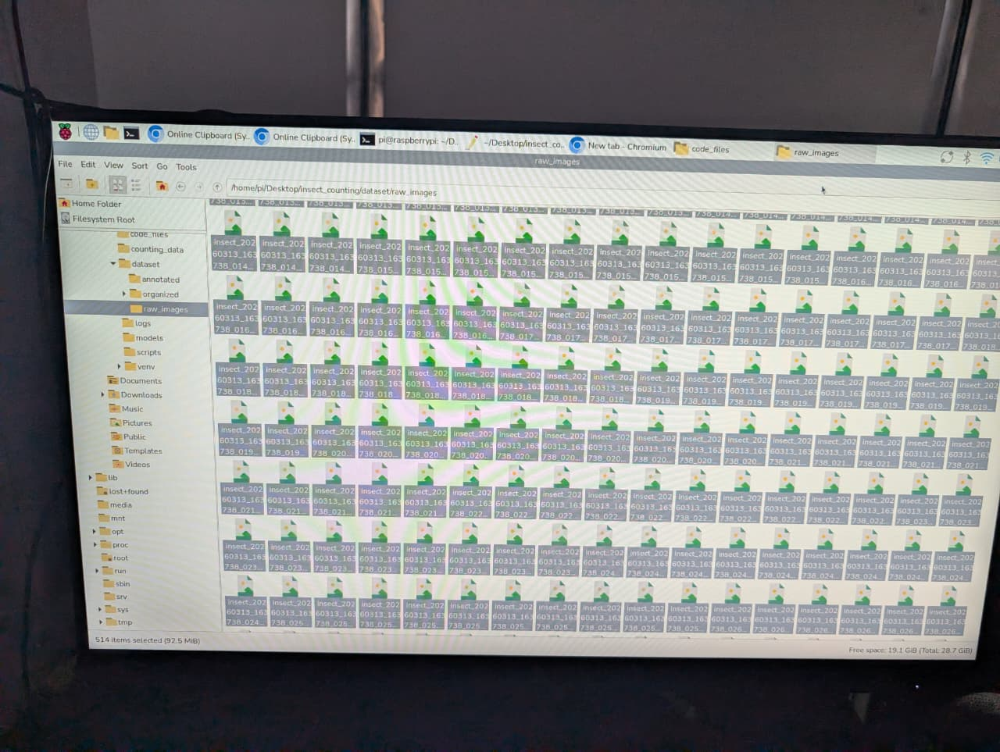
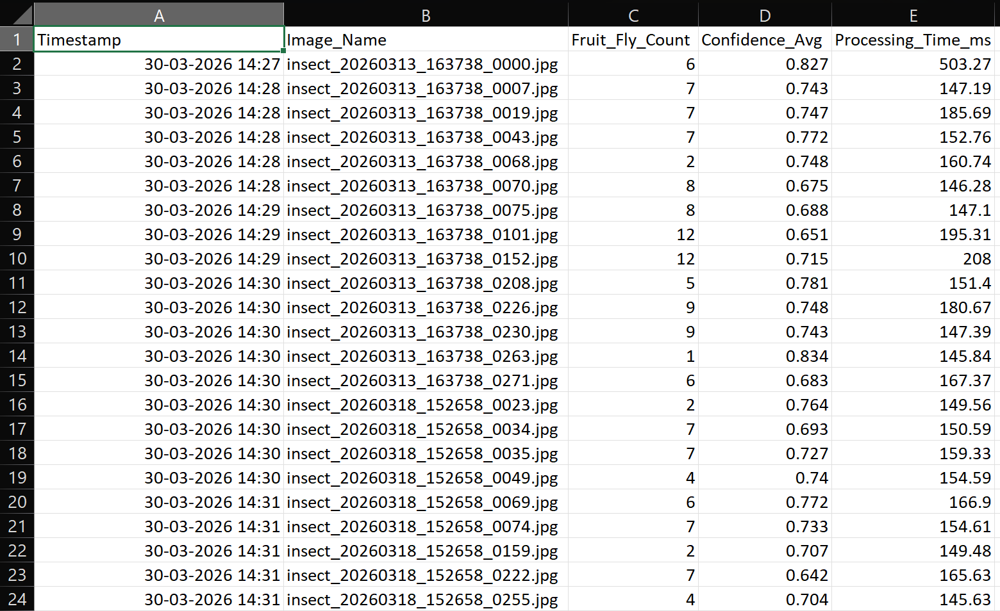
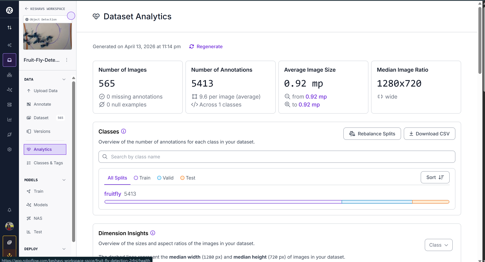

# Automated Insect Detection & Counting System

## 📌 Project Overview

A real-time fruit fly detection and counting system using **YOLOv8 deep learning** deployed on **Raspberry Pi 4**. This project combines computer vision, edge AI, and IoT to create an automated agricultural monitoring solution.

**Key Achievement**: 93% accuracy with automated counting, CSV logging, and custom 3D-printed hardware integration.

---

## 🎯 Problem Statement

Agricultural pest monitoring requires continuous manual observation, which is time-consuming and labor-intensive. This project automates fruit fly detection and counting using deep learning on edge devices for real-time monitoring.

---

## 💡 Solution Architecture

### High-Level Flow:

```
Data Collection → Annotation → Model Training → Pi Deployment → Real-Time Detection
     ↓              ↓              ↓                ↓               ↓
 1100+ Images  Roboflow       YOLOv8           Optimization    CSV Logging
```



---


---

## 🛠️ Technology Stack

### Machine Learning
- **Framework**: PyTorch with YOLOv8
- **Dataset**: 520 annotated images
- **Annotation Tool**: Roboflow
- **Augmentation**: Flip, Rotation (±15°), 90° Rotate, Blur, Noise

### Hardware
- **Device**: Raspberry Pi 4 (4GB)
- **Camera**: HQ Camera Module (5MP)
- **3D Design**: Custom-printed enclosure

### Software
- **Computer Vision**: OpenCV
- **Data Processing**: Pandas, NumPy
- **Logging**: CSV with timestamps
- **Real-time Display**: OpenCV visualization

---

## 📊 Project Results

### Model Performance

| Metric | Value |
|--------|-------|
| **mAP@50** | 93% |
| **Precision** | 90.1% |
| **Recall** | 93.0% |
| **Training Data** | 520 annotated images |
| **Real-time FPS** | 5-10 FPS on Pi 4 |

---

## 🎬 Project Pipeline

### Phase 1: Data Collection
- Captured **1,100+ images** on Raspberry Pi HQ Camera
- Various scenarios: different lighting, angles, close-ups, far shots
- Consistent dome setup for standardization



### Phase 2: Data Annotation
- Annotated **520 images** using Roboflow
- Manual bounding box creation around each fruit fly
- ~2-3 hours of annotation work
- Single class: "fruit fly"



### Phase 3: Model Training
- **Framework**: YOLOv8 Nano (optimized for Pi)
- **Training Environment**: PC with Python + PyTorch
- **Augmentation**: 3x multiplier for better generalization
- **Result**: 93% mAP@50 in just 8 epochs (early stop due to excellent performance)



### Phase 4: PC Simulation Testing
- Created Python simulator to test model on PC
- Tested on 30 unannotated images
- Live detection display with 15-second intervals
- CSV logging of results

### Phase 5: Raspberry Pi Deployment
- Installed 64-bit Raspberry Pi OS
- Optimized PyTorch inference (CPU-only)
- Deployed real-time detection system
- Automated snapshot capture every 60 seconds



### Phase 6: Hardware Integration
- **3D Enclosure Design**: Custom-printed trap housing
- **Components**: Camera mount, Pi housing, pheromone chamber
- **Purpose**: Integration point for field deployment



---

## ✨ Key Features

### Real-Time Detection
- Live camera feed with bounding boxes
- Fruit fly count displayed on screen
- FPS monitoring
- Confidence scores for each detection

### Automated Logging
- CSV file with timestamp, count, and confidence
- Automatic snapshot capture every 60 seconds
- Session statistics and duration tracking
- Organized data structure for analysis

### User Controls
- **SPACE**: Pause/Resume detection
- **S**: Save snapshot manually
- **Q**: Quit and display statistics

### Hardware Integration
- Custom 3D-printed enclosure
- Professional mounting for Pi and camera
- Pheromone trap integration design
- Field-deployment ready



---

## 📈 Metrics & Performance

### Detection Accuracy
- **93% mAP@50**: Industry-competitive accuracy
- **90.1% Precision**: Minimal false positives
- **93% Recall**: Excellent fly detection rate

### System Performance
- **Processing Speed**: 5-10 FPS on Raspberry Pi 4
- **Memory Usage**: ~400-600MB RAM
- **CPU Usage**: 60-80%
- **Model Size**: ~20MB (optimized)

### Data Logging
- **CSV Format**: Timestamp, count, confidence, processing time
- **Snapshot Interval**: Every 60 seconds (configurable)
- **Session Tracking**: Duration, total frames, total detections



---

## 🚀 How to Use

### Quick Start

```bash
# 1. Clone repository
git clone https://github.com/keshaysays08/Automated-Insect-Detection-Counting-System.git
cd Automated-Insect-Detection-Counting-System

# 2. Install dependencies
pip install -r requirements.txt

# 3. Download dataset
python scripts/download_dataset.py

# 4. Run real-time detection
python scripts/realtime_detection.py
```

### Output Files
After running the system, you'll get:
- `detection_logs/detection_log_YYYYMMDD_HHMMSS.csv` - Detailed detection data
- `detection_logs/captured_detections/` - Snapshot images with detections

### Configurable Parameters
Edit `config/config.yaml` to adjust:
- Confidence threshold (0.0-1.0)
- Frame delay between captures
- Snapshot capture interval

---

## 🔬 Dataset Information

### Statistics
- **Total Images Collected**: 1,100+
- **Images Annotated**: 520
- **Classes**: 1 (fruit fly)
- **Train/Val/Test Split**: 70/20/10

### Data Augmentation
- Horizontal flip
- Rotation (±15°)
- 90° rotations (all directions)
- Blur (up to 1px)
- Noise (up to 1.68%)
- **Augmentation Multiplier**: 3x

### Download Dataset
```bash
python scripts/download_dataset.py
```


---

## 🔧 Technical Details

### Environment Setup
- **Python**: 3.11+
- **OS**: 64-bit Raspberry Pi OS (Bookworm)
- **Virtual Environment**: Conda with system packages
- **GPU**: CPU-only (optimized for Pi)

### Dependencies
All dependencies listed in `requirements.txt`:
- torch==2.0.1
- ultralytics==8.0.200
- opencv-python==4.8.1
- pandas==2.0.3
- And others for full pipeline

### Model Architecture
- **Base Model**: YOLOv8 Nano
- **Framework**: PyTorch → TorchScript optimization
- **Input Size**: 640×480 (adjustable)
- **Output**: Bounding boxes with confidence scores

---

## 📁 Project Structure

```
Automated-Insect-Detection-Counting-System/
├── scripts/
│   ├── realtime_detection.py    # Main detection system
│   └── download_dataset.py       # Roboflow dataset download
├── runs/
│   └── best.pt                   # Trained YOLO model
├── config/
│   └── config.yaml               # Configuration parameters
├── hardware/
│   └── assembly_guide.md         # 3D enclosure assembly
├── docs/
│   ├── SETUP.md                  # Installation guide
│   └── USAGE.md                  # Usage instructions
├── README.md                      # This file
├── requirements.txt               # Python dependencies
└── .gitignore                     # Git ignore rules
```

---

## 🤝 Author

**Keshav Gairola**
- Portfolio: [keshav-gairola-portfolio.vercel.app](https://keshav-gairola-portfolio.vercel.app)
- GitHub: [@keshaysays08](https://github.com/keshaysays08)
- Email: keshavsays08@gmail.com

---

## 📝 License

This project is licensed under the MIT License - see the LICENSE file for details.

---

## 🙏 Acknowledgments

- YOLOv8 by Ultralytics
- Roboflow for annotation platform
- Raspberry Pi Foundation
- PyTorch community

---

**Last Updated**: April 2026
